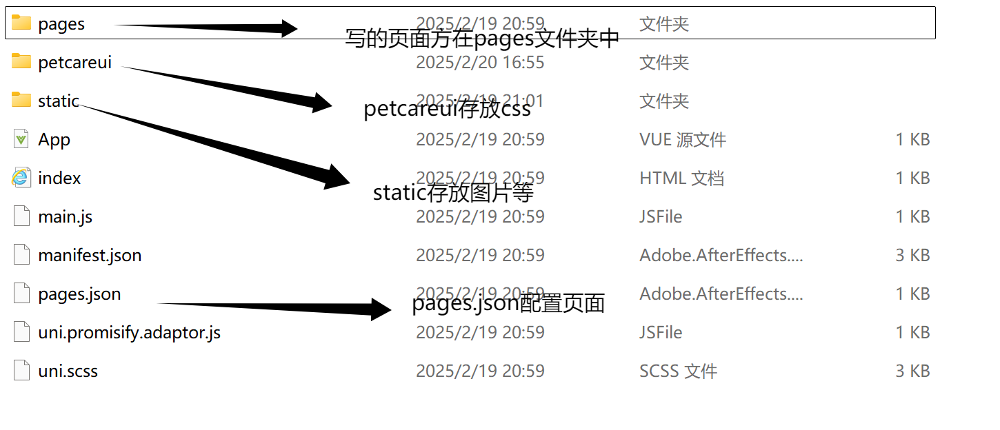
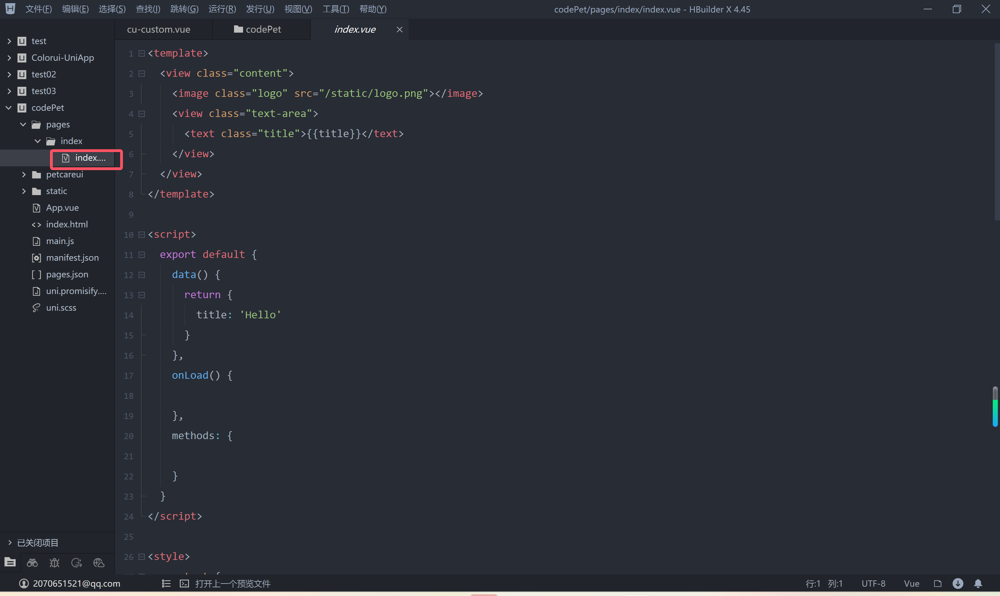
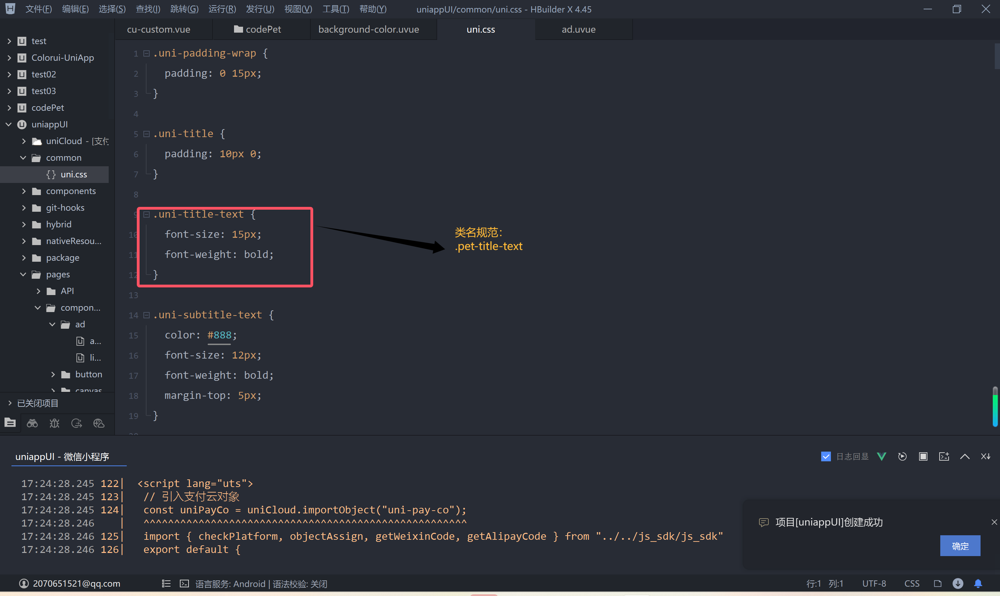

# PetCare
这是汪汪喵小程序的代码库

---

### 01**洗护功能概述**    

#### **1. 洗护预约（到店服务）**  
- 用户选择**洗护预约**后，进入**师傅列表页面**，可筛选：  
  - 店铺地点  
  - 服务对象（猫/狗）  
  - 预约时间  
- 选择合适的师傅后，进入**分类**，选择所需服务。  
- 确认并支付订单后，系统通知师傅或门店进行服务安排。  

#### **2. 上门洗护服务（一键上门）**  
- 用户点击 **“一键上门”**，进入**分类**界面，选择：  
  - 服务对象（猫/狗）  
  - 服务类型    
  
- 系统根据**地理位置**自动匹配**最近可接单的师傅**（需要制作新页面），提供详细信息供用户确认。  

- 确认并支付后，系统通知师傅前往用户指定地点提供上门服务，用户可实时查看师傅位置和预计到达时间。  

  **例：洗护预约->师傅列表->分类（假设选择了接宠洗澡）->洗护详情**

---

### 02.**社区&发布功能概述**

#### 1.社区

- 参照**小红书**，实现用户交流，涉及点赞等操作
- **信息流展示**：采用瀑布流布局，展示用户发布的图文动态，内容包括宠物日常、经验分享、洗护反馈、宠粮推荐、代看服务等。

#### 2.发布

**内容编辑**

- **文字输入**：用户可以输入帖子标题和正文，支持格式化文本（如换行、表情）。
- **分类选择**：用户可选择帖子类别，如“日常”“宠粮”“洗护”“代看”“救助”等，确保帖子在社区内精准分流。
- **图片/视频上传**：用户可上传宠物照片或短视频，支持拖拽调整顺序，并提供基础编辑功能（裁剪、旋转）。

 **标签与话题**

- **热门话题推荐**：用户可选热门话题（如 #今日萌宠、#宠物趣事）。
- **自定义标签**：支持用户手动添加标签，提高帖子可见度。

**位置信息**（可选）

- **定位服务**：支持用户选择或手动输入地理位置，适用于线下活动、救助信息等场景。

## 一些提示
1.[创建页面](https://uniapp.dcloud.net.cn/tutorial/page.html).

2.大概文件

所给的文件已经创建了一个index.vue,大家不要在这个页面做修改（合并很容易出错），自己重新创建一个页面写

3.类名规范

**pet-xx**

***最后，有问题一定要和我联系***

# 3.16

- 每次从github拉取mian分支时，先将本地分支切换到mian分支
- 3.16以前建立的所有分支已在github上删除，大家自行删除本地分支以及和github上相关分支的联系**（文件自行保存）**
- 每次任务需要大家拉取github上的main分支到本地后自己创建新分支修改，**千万不要在main上直接做修改**

---

# 3.18

1.**社区**页面直接在原来的**Community**操作，不用新建

2.新建页面时，删除给出的原始内容，将**index**的内容复制过来

2.**发布**页面要新建，并将底部tabber地址改为相应地址

3.UI库（另一组同学负责设计UI）:*[汪汪喵UI库](https://js.design/f/7Pmqbf?p=jewIYko0EZ&mode=design)*（以后新的页面大家在这里查看）

